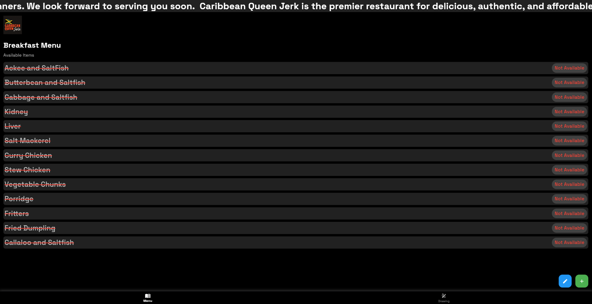

# Caribbean Queen Restaurant Food Menu App

A dynamic digital menu application for Caribbean Queen Restaurant, allowing cashiers to manage and display the daily food menu with both text and drawing capabilities.



## Overview

Caribbean Queen Restaurant's Food Menu App is designed to streamline the process of displaying and managing the restaurant's menu. The app features a dynamic marquee text display, automatic availability updates based on time, and a drawing board for creating visual menu items or special announcements.

## Features

### Menu Management
- **Dynamic Menu Items**: Add, remove, and toggle availability of menu items
- **Automatic Time-Based Availability**: Items automatically become available/unavailable based on restaurant hours (5 AM - 11 AM for breakfast items)
- **Manual Override**: Cashiers can manually set item availability regardless of time
- **Visual Status Indicators**: Clear visual cues for available and unavailable items
- **Swipe-to-Delete**: Easily remove items from the menu with a simple swipe gesture

### Marquee Text Display
- **Customizable Scrolling Text**: Edit the marquee text to display promotions, specials, or announcements
- **Consistent Display**: The same marquee text appears on both the menu and drawing screens
- **Stylish Design**: Large, readable text with Space Grotesk font for a modern look

### Drawing Board
- **Interactive Canvas**: Create visual menu items or special announcements
- **Multiple Drawing Tools**: 
  - Pencil for freehand drawing
  - Line tool for straight lines
  - Polygon tool for creating shapes
  - Square and circle tools
  - Eraser for corrections
- **Color Selection**: Choose from a wide palette of colors
- **Size Adjustment**: Customize stroke and eraser sizes
- **Shape Filling**: Option to fill shapes with color
- **Grid Guide**: Toggle grid lines for precise drawing
- **Undo/Redo**: Correct mistakes with undo and redo functionality
- **Background Image**: Add or remove background images to your drawings
- **Export Options**: Save your drawings as PNG or JPEG files

### User Interface
- **Bottom Navigation**: Easy switching between Menu and Drawing screens
- **Responsive Design**: Adapts to different screen sizes
- **Time Display**: Current time shown prominently on the menu screen
- **Space Grotesk Typography**: Modern, readable font throughout the app

## Getting Started

### Prerequisites
- Flutter SDK (latest version)
- Dart SDK (latest version)
- Android Studio / VS Code with Flutter extensions

### Installation

1. Clone the repository:
   ```
   git clone https://github.com/lagrandecode/food-menu.git
   ```

2. Navigate to the project directory:
   ```
   cd caribbean-queen-menu-app
   ```

3. Install dependencies:
   ```
   flutter pub get
   ```

4. Run the app:
   ```
   flutter run
   ```

## Usage

### Menu Screen
- **View Menu Items**: All breakfast items are displayed with their availability status
- **Toggle Availability**: Tap on an item to toggle its availability
- **Add New Items**: Use the green floating action button to add new menu items
- **Remove Items**: Swipe left on an item to delete it
- **Edit Marquee Text**: Use the blue floating action button to edit the scrolling text

### Drawing Screen
- **Select Drawing Tool**: Choose from the available tools in the sidebar
- **Draw on Canvas**: Create visual menu items or announcements
- **Change Colors**: Select from the color palette
- **Adjust Size**: Use the sliders to change stroke or eraser size
- **Save Drawing**: Export your drawing as PNG or JPEG

## Technical Details

### State Management
- **Provider Pattern**: Used for managing shared state (marquee text)
- **ValueNotifier**: Used for reactive UI updates in the drawing board

### Architecture
- **Clean Architecture**: Separation of concerns with domain, presentation, and data layers
- **Widget Composition**: Modular design with reusable components

### Dependencies
- **google_fonts**: For Space Grotesk typography
- **provider**: For state management
- **marquee**: For scrolling text display
- **file_picker**: For selecting background images
- **file_saver**: For exporting drawings
- **image_picker**: For selecting images from gallery
- **url_launcher**: For opening external links

## About Caribbean Queen Restaurant

Caribbean Queen Jerk is the premier restaurant for delicious, authentic, and affordable Jamaican cuisine in the Greater Toronto Area. We are proud to serve you great food across five locations, including our special Caribbean buffet. Our leadership team has spent more than a decade working together to build a delicious menu and a positive customer experience. Our food is fresh and our smiles are free. Our doors open at 6:00 am to welcome hundreds of hungry clients for breakfast, and they don't close until everyone has enjoyed their tasty Caribbean lunches and dinners. We look forward to serving you soon.

## License

This project is licensed under the MIT License - see the LICENSE file for details.

## Acknowledgments

- Developed by OLUWASEUN OGUNMOLU
- Inspired by the need for efficient menu management in Caribbean Queen Restaurant 